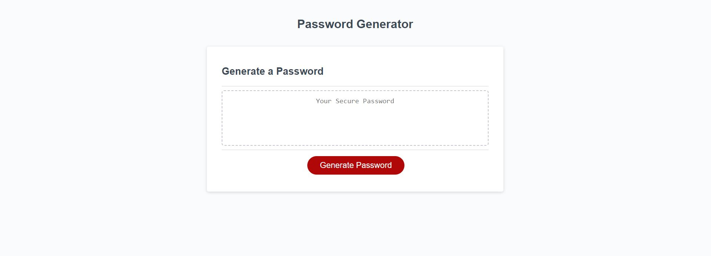
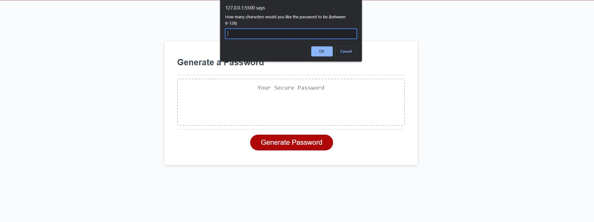
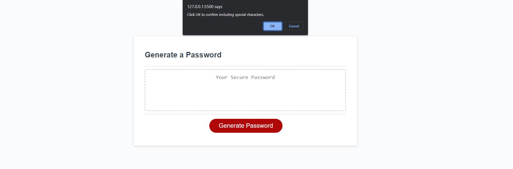
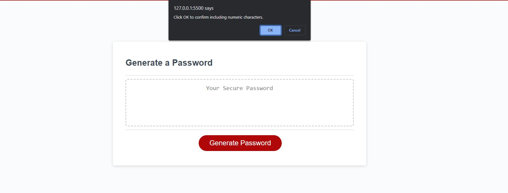
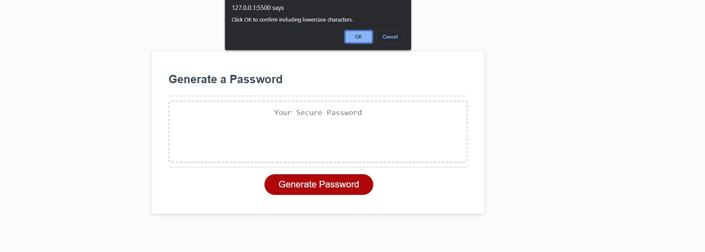
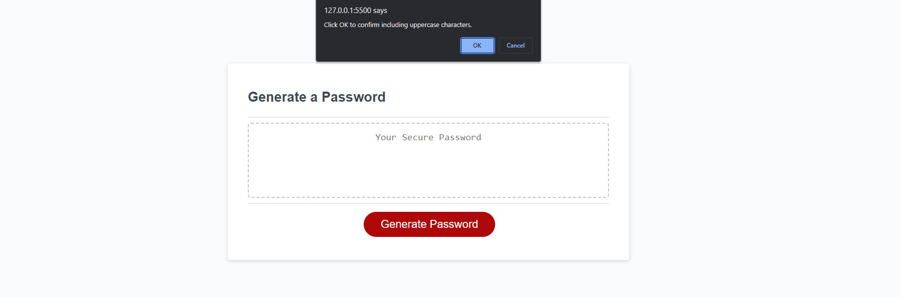
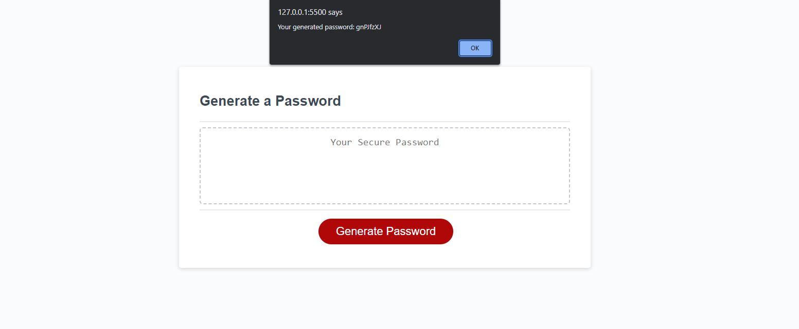

# Random-Password-Generator
## Description

The goal of this project is to create a random password generator. This application is useful for creating random and secure password whilst letting the user choose the parameters, such as length and characters contained within the password. During the creation of this project I learnt the importance of having an interactive application.

## Usage

To use this application the user must click the button that says "Generate Password".

Once the button has been clicked a promt will come up asking for the desired length of the password.

Then the user is asked for confirmation on several character parameters.

And then once all the parameters have been selected the password will be generated.

Link to working application: https://daniel-bindig.github.io/Random-Password-Generator/

